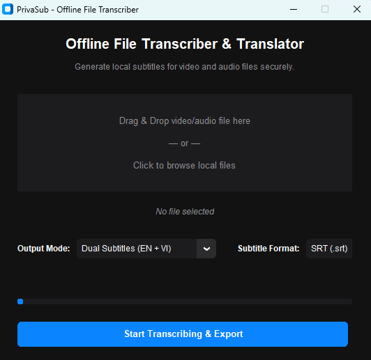

# Configuration & Settings

PrivaSub is designed to run in the background with minimal user interaction. Most settings are controlled through the **System Tray** menu.

---

## Finding the System Tray Menu

On Windows, the System Tray is located in the bottom-right corner of your screen:
1. **Look next to the clock:** Locate the Windows taskbar clock, calendar, and Wi-Fi/speaker status icons in the bottom-right corner of your monitor.
2. **Show hidden icons (if needed):** If you don't see the PrivaSub icon immediately, click the **upward arrow icon (`^`)** to open the hidden icons list.
3. **Locate the PrivaSub icon:** Look for the dark blue-and-white rounded icon representing subtitles (with a bright blue border).
4. **Open the menu:** **Right-click** on the PrivaSub icon to bring up the context menu, containing all configurations.

```
[ ^ ] [ Wifi ] [ Speaker ] [ ENG ] [ 08:55 AM ]
  ▲
Click here to show hidden icons if the PrivaSub logo is not visible.
```

---

## Enabling/Disabling Vietnamese Translations

You can toggle the Vietnamese translation overlay on or off at any time:
1. **Right-click the PrivaSub icon** in the System Tray.
2. Check or uncheck **Show Translation (Vietnamese)**:
   * **Enabled (checked):** Displays dual subtitles. The top line displays the original English speech (White), and the bottom line displays the translated Vietnamese text (Sleek iOS Yellow `#FFD60A`). The overlay window height is automatically set to `110px`.
   * **Disabled (unchecked):** Displays English subtitles only. The Vietnamese translation text and label disappear. The overlay window height automatically shrinks to `80px` to conserve screen space.
   * *Performance optimization:* When translation is disabled, the local translation model inference is skipped entirely, saving significant CPU and memory resources.

---

## Subtitle Overlay Modes

The subtitle overlay has two main modes: **Unlocked (Draggable)** and **Locked (Click-Through)**.

### Moving the Subtitle Bar (Unlocked)
1.  Right-click the PrivaSub System Tray icon.
2.  Check **Toggle Draggable (Unlock)**.
3.  A gray border will appear around the subtitle bar. Click and drag the subtitle bar to position it anywhere on your screen.

### Locking and Click-Through (Locked)
1.  Once you have positioned the subtitles, right-click the System Tray icon and uncheck **Toggle Draggable (Unlock)**.
2.  The border will disappear. The overlay is now in **Click-Through** mode.
3.  Any mouse click in the area of the subtitles will pass directly "through" the window, allowing you to click YouTube controls, play/pause video players, or click buttons in Zoom meetings without the subtitles blocking you.

---

## Pause / Resume Controls

If you are listening to music, playing games, or in a call where you don't need subtitles, you can pause the capture engine to save CPU cycles:
1.  Right-click the System Tray icon.
2.  Select **Pause Listening**.
3.  The subtitle window will display `PrivaSub: Paused` and stop listening.
4.  Select it again to resume transcribing.

---

## Auto-Hide & Fade-Out

To keep your screen clean, the subtitle overlay automatically manages its own visibility:
*   **Active Transcribing:** The window stays fully visible with your custom opacity (default is `0.8`).
*   **Pause in Speech:** If no new speech is transcribed after 4-6 seconds, the window triggers a smooth fade-out animation.
*   **Hidden State:** Once faded out, the window is hidden (`withdrawn`) so it takes up zero screen space. It will automatically reappear as soon as someone starts speaking again.

---

## Anonymous Sub (Settings UI)

You can permanently configure your privacy preferences directly from the **Application Settings** window (right-click the System Tray icon and select **Settings**):
*   **Hide Subtitles during Screen Share:** Toggle on to make the subtitle window entirely invisible to screen sharing applications like Zoom, Google Meet, Microsoft Teams, and OBS. You will see the subtitles clearly on your monitor, but anyone viewing your shared screen will see nothing.
*   **Save & Apply / Reset:** Click **Save & Apply** to persist these settings across restarts, or click **Reset to Defaults** to restore standard behavior.

---

## Offline File Transcriber

PrivaSub allows you to transcribe and translate local video and audio files completely offline:



### Step-by-Step Guide:
1. **Open the window:** Right-click the PrivaSub System Tray icon and select **Open File Transcriber**.
2. **Select a media file:**
   * **Drag-and-Drop:** Drag any supported video (.mp4, .mkv, .mov, etc.) or audio (.mp3, .wav, .m4a, etc.) file directly into the dotted drop-zone area.
   * **Click to Browse:** If drag-and-drop is restricted by system permissions, click anywhere inside the dotted area to open the standard file chooser dialog.
3. **Configure output settings:**
   * **Output Mode:** Select between **Dual Subtitles (EN + VI)** (both languages), **English Only**, or **Vietnamese Only**.
   * **Subtitle Format:** Select **SRT (.srt)** (standard video player subtitles) or **VTT (.vtt)** (web video subtitles).
4. **Process the file:** Click the blue **Start Transcribing & Export** button.
   * The UI will lock and show a progress bar.
   * The real-time loopback capture is temporarily paused during file processing to maximize CPU performance.
5. **Open output folder:** Once finished, a success dialog pops up. Click the green **Open Subtitles Folder** button. Windows Explorer will open showing the generated subtitle file (saved directly next to the original media file) highlighted.
